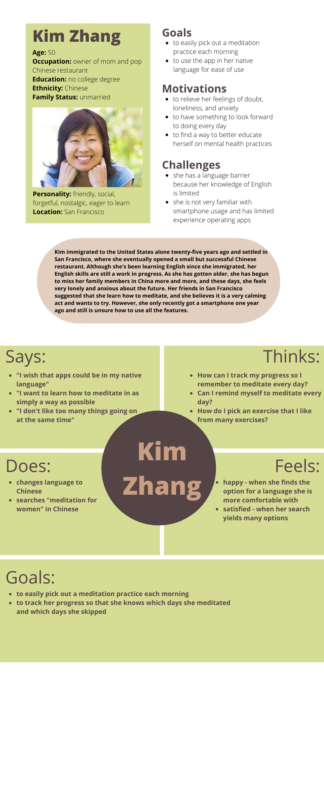

# DH150 Assignment05 - Fontanna Yee
## Purpose of Storytelling

UX storytelling is essential for person-centered design because it reminds the designer that they are creating a product with the user in mind. Without storytelling, there would be a disengagement between the product and the user, as the designer has a limited view of what the user needs, and could possibly create something that would not ease the frustrations of the user’s journey at all. By developing a product with multiple hypothetical users in mind during the design process, the designer can better envision the goals, needs, and contexts of the people who will eventually use the product, and seek to create a product that best represents the user’s story and best serves their needs. 

## Features
1) Language - Allow user to change to a language that is more comfortable for them to communicate
2) Do Not Disturb - Silence notifications while using the app to meditate to minimize distractions 

## Persona and Empathy Maps
1) Kim Zhang

