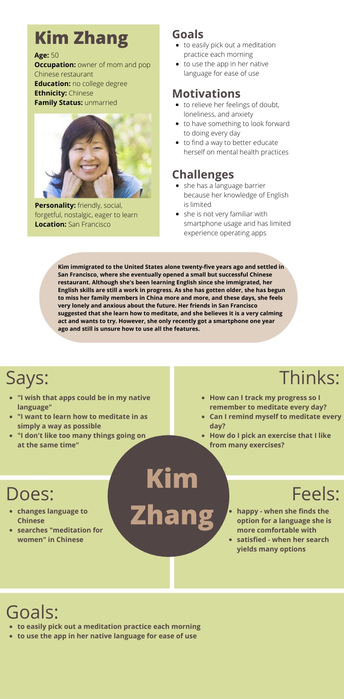
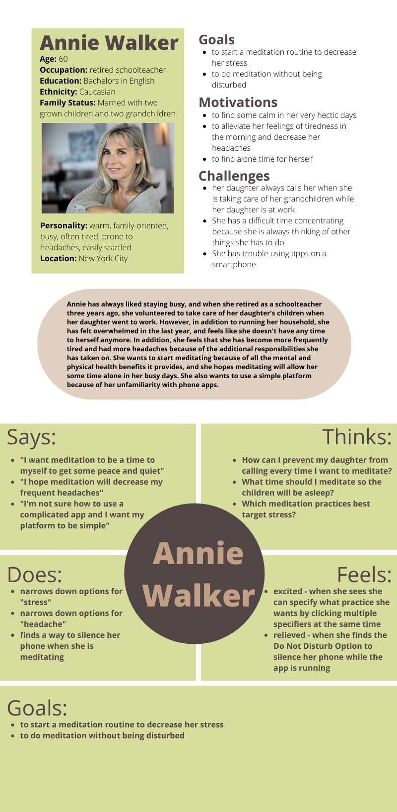
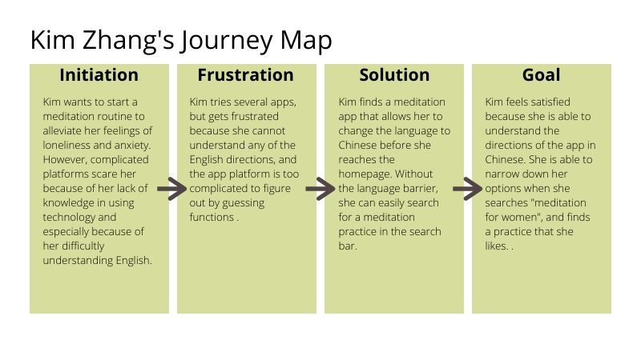
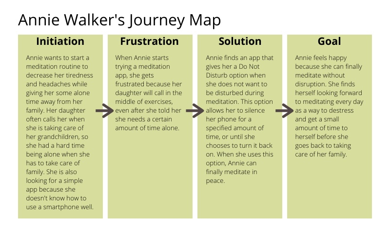

# DH150 Assignment05 - Fontanna Yee
## Purpose of Storytelling

UX storytelling is essential for person-centered design because it reminds the designer that they are creating a product with the user in mind. Without storytelling, there would be a disengagement between the product and the user, as the designer has a limited view of what the user needs, and could possibly create something that would not ease the frustrations of the user’s journey at all. By developing a product with multiple hypothetical users in mind during the design process, the designer can better envision the goals, needs, and contexts of the people who will eventually use the product, and seek to create a product that best represents the user’s story and best serves their needs. 

## Features
1) Language - Allow user to change to a language that is more comfortable for them to communicate
2) Do Not Disturb - Silence notifications while using the app to meditate to minimize distractions 

## Persona and Empathy Maps
1) Kim Zhang

2) Annie Walker

## Scenario and Journey Maps

### Kim Zhang's Scenario

**WHY:** Kim is a fifty year old Chinese woman who immigrated alone to the United States alone twenty-five years ago. She settled in San Francisco and eventually opened a small but successful Chinese restaurant, where she has been the owner and chef for over two decades.  Although she's been learning English since she immigrated, she still faces a language barrier in her everyday life. In recent years, Kim has begun to feel more loneliness and anxiety about the future, as she thinks about her retirement from restaurant life and her immense distance from family members back home. Her friends in San Francisco suggested that she learn how to meditate, and she agrees that it might be a good way to improve her mental health and give her an activity to look forward to every day. However, she is worried about not understanding directions because of her language barrier and not knowing how to select a meditation practice she wants because she is unfamiliar with using a smartphone. 

**HOW:** Kim opens the meditation app, and immediately sees options to change the language from English to Chinese, Spanish, or Russian, each written in that specific writing system. She clicks the option for Chinese, and the homepage of the app appears with all the text in Chinese. She goes to the search bar that is displayed in the top right corner with the word “search” in Chinese, and searches for “meditation for women” in Chinese. A list of relevant meditation exercises appear, each appearing with a photo and the length of time of the exercise. Kim picks the option she likes the best. 

### Annie Walker's Scenario

**WHY:** Annie is a sixty year old retired schoolteacher that enjoys staying home to take care of her young grandchildren when her daughter is at work. She has always liked staying active and busy, and taking care of her grandchildren while also running a household makes her happy, for the most part. However, in the last year, she has felt increasingly overwhelmed in the last year, and feels like she doesn't have any time to herself anymore. In addition, she has been tired more frequently and has suffered more headaches. She wants to start meditating because of all the mental and physical health benefits it provides, and she hopes meditating will allow her some time alone in her busy days. She is worried about her daughter continuously calling while she is trying to meditate, and hopes that there is a way to silence her phone. She is also looking for a simple platform because of her unfamiliarity with using apps. 

**HOW:** Annie opens the meditation app and starts searching for some sort of Do Not Disturb feature. She sees a moon icon on the bottom right corner of the homepage and clicks on it. A list of options pop up, including “Do Not Disturb for 15 Minutes”, “Do Not Disturb for 30 Minutes”, “Do Not Disturb for 1 Hour”, or “Until I Turn Back On”. She selects the “Until I Turn Back On” option, and a message pops up confirming her choice. She then goes to the search bar at the top right corner, labeled “search”. She types “stress, headache” and a list of relevant options appear. Annie picks the option she likes the best. 

