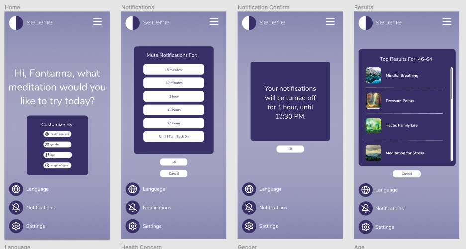
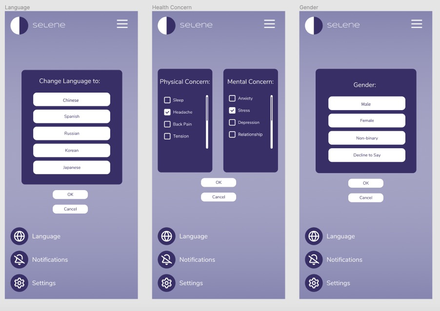

# DH150 Assignment07 High Fidelity Prototype
## Graphic Design

### Reasoning for Design
Because I was designing an application targeted towards older adults who might be unfamiliar with technology, I kept the color scheme and the design as minimalist as possible. I went for a purple color scheme because I felt that the colors were easy to see without straining the eyes, and purple complemented the name of my meditation app, Selene, which references nighttime and the moon. I also kept the design minimalistic and centered around mostly text so that users would not get confused with a cluttered and busy homepage and additional screens. I used a sans serif font in a large text size so that the words would be clear and easy to read, and I kept the words dark purple and white to maintain a high contrast with the background. Thinking especially about my personas and about the design principles I learned, I made sure to add written labels for my icons, such as “Language” and “Notifications,” because I know that the icons are not intuitive to understand for everyone. 
