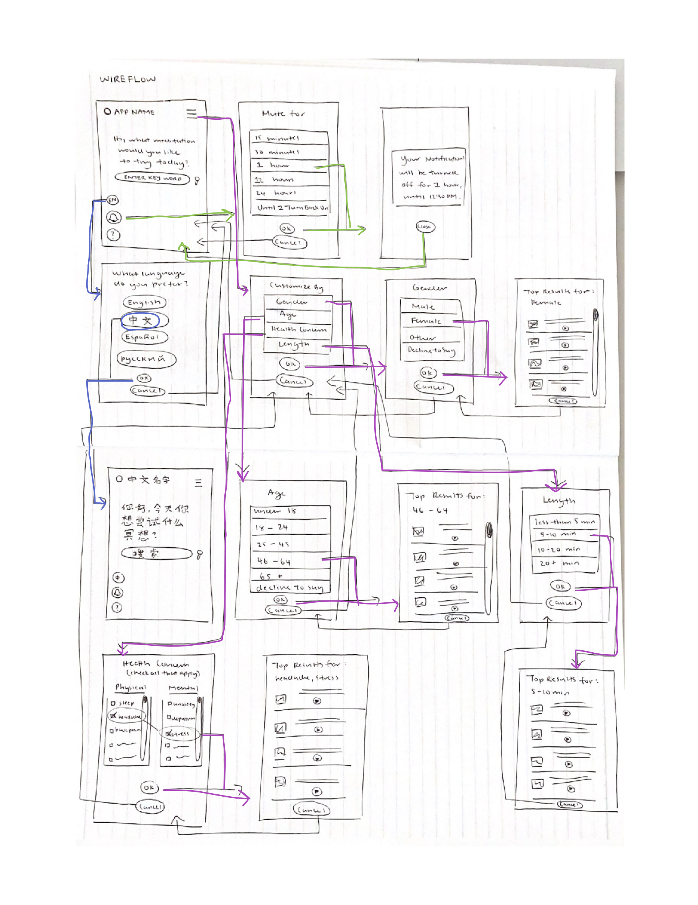

# Selene - Simple Meditation for Complex Lives
### Fontanna Yee - DH 150 (User Experience Design) - Fall 2020
## Introduction
When I was given the prompt to create a project that benefitted some aspect of life for middle-aged women, I decided to combine user experience with my interests in psychology and mental health to create a meditation application. Especially during the Covid-19 pandemic, mental health stressors have been at an all-time high, and I thought it was important to give older adults a platform to address mental health concerns. Many current meditation websites and apps are unnecessarily complicated and can be overwhelming for older adults to navigate and turn them away from the benefits of meditation, especially if they are unfamiliar with using technology. My goal in this project was to create a meditation app that replaced complicated interfaces and an overwhelming amount of choices with a simple, user-friendly design and clear options for customization. I hope that eliminating the stress of navigating complicated apps and websites would help older women, and adults in general, feel more comfortable creating a meditation routine that best addresses their daily life stressors, especially exacerbated by the pandemic. 

## Clear design statement
Based on weeks of research, usability testing, and contextual interviews, I prioritized simplicity and customization in my design. I primarily focused on assisting primarily middle-aged women in finding a meditation practice that best addresses their physical and mental health concerns. With this in mind, I identified three key features that minimized excess stress in a meditation routine, based on the two users personas that informed my design. 

**Feature 1: Changing the Language**

One of my personas was a middle-aged woman who doesn’t speak English as a native language, so I included a language option that allows a user to change to a language that they are more comfortable using to interact with the app.This would make the app more appealing for users who were interested in meditation but intimidated by primarily English platforms. 

**Feature 2: Turning off Notifications**

My second persona was a middle-aged woman who has a hectic family life and receives frequent calls from her daughter when she is taking care of her grandchildren. Because of this need, I included a notification option that allows users to mute external notifications for a specified amount of time. This feature would accommodate users who have constant disturbances on their phone that could interrupt the focus and concentration needed to meditate successfully. 

**Feature 3: Customizing Meditation Options**

Both my personas were unfamiliar with using app interfaces and were looking for a simple, minimalistic platform to use that could accommodate for different needs. Because of this, I created a simple color-block design with easy-to-recognize features with large and clear labels, which would make navigating the app much easier and less stressful. I also placed the customization feature in the center of the home screen, which makes the customization options easy to identify. 

## Competitor analysis

The first step in user experience research was to examine competitor platforms that provided the same services that my application would be intended for, in this case, online meditation. I decided to evaluate both a web platform, Mindful.org, and a meditation app, Calm, to understand what features worked well and what features didn’t, and what were the most important features to include in a meditation application. 

### Heuristic Evaluation

I first completed a heuristic evaluation of both platforms based on ten fundamental design principles that inform good design. 
For Mindful.org, my most important findings were:
* 1) improving on the descriptions of topics so that users could find what they were looking for easier (Match between system and the real world)
* 2) maintaining consistency between the layouts of each page (Consistency and standards)
* 3) implementing a much simpler and less cluttered design (Aesthetic and minimalist design). 
For Calm, my most important findings were:
* 1) using more labels and text to identify the purpose of some icons (Recognition rather than recall)
* 2) providing greater feedback during user error (Help users recognize, diagnose, and recover from errors)
* 3) placing help features in more prominent places (Help and documentation). 

[Full Evaluation Here](https://github.com/fyee1215/DH150-FontannaYee/blob/main/README.md)

<table>
  <tr>
    <td></td>
    <td></td>
  </tr>
</table>

### Usability Testing

I then conducted usability testing on Mindful.org, where I asked another participant to go through one of the competitor sites to identify issues with completing basic tasks that either confirmed my heuristic evaluations or pointed out problems that I had overlooked. I asked the participant to complete three tasks using Mindful.org: 1) search "stress" for a breathing exercise, 2) find a mediation practice for children, and 3) find the email address to contact for help. 

[Full Usability Test Here](https://github.com/fyee1215/DH150-FontannaYee/tree/main/assignment02)

## User Research
The next step in the user research process was to conduct a contextual inquiry with an external participant to identify key areas that my meditation application should address. The participant gave me key insights of the reasoning behind why they would choose to use a meditation app, what they would like to see, and how they would choose a meditation practice. Some of their comments were especially interesting, and the following three in particular would later inform my design choices. 

**The importance of simplicity and authenticity**

  * *“Think simplicity is a big one for me. Like, especially if I'm trying to go somewhere, even virtually to clear my mind. I wouldn't want a cluttered app or a very cheesy app. Like I just hate cheesiness all around. … I just like maybe a simple, like home page, something that I can just go to for my daily routine, something I can use to track my progress. Like, I don't think I need a ton of stuff in terms of like, music or, like, very pretty aesthetic things.”*

**The importance of customized options**

  * *“I think having somebody to help me assess what I need, would be helpful. Like the questions that Calm asked at first, like, what are you doing this for? What do you hope to get out of it that was useful, not just for their algorithms, but also for me to kind of streamline my thoughts?”*

**A con of using a digital platform**
  * *“But also like, because meditation is inherently supposed to be like distraction free, right? And the phone is a huge distractor. So maybe finding a way to, I don't know, like, make the user less reliant on looking at the screen while they're doing the meditation would be helpful.”*

[Full Contextual Inquiry Here](https://github.com/fyee1215/DH150-FontannaYee/tree/main/assignment04)

## UX Storytelling
Until this process in the research process, I had been conducting usability testing and interviewing potential users of meditation apps, but a crucial part of UX research is keeping the user at the center of my design. To best inform my future designs and maintain the perspective of middle-aged women, I created two user personas of two middle-aged women from very diverse backgrounds, who could both potentially be users of my application. For each persona, I identified their goals, motivations, and challenges that my application would address, and created empathy maps to identify their biggest frustrations that my application could solve. 

[Full Personas Here](https://github.com/fyee1215/DH150-FontannaYee/tree/main/assignment05)

## Low-fidelity Prototype 
The low-fidelity prototype of my meditation app implemented all the information I had collected from prior weeks of user research. Through creating user personas, I was able to identify three key features that were the most important to include in the application: language, notifications, and customization. The purpose of this low-fidelity prototype was to test how to integrate these features into a functioning and intuitive layout and ensure that they can be used to achieve the goals intended. After I walked through my wireflow with a participant, I was able to make the following revisions to my preliminary wireframes and wireflows in my high-fidelity prototype: 
* 1) Eliminating the “okay” button when the options were already interactive 
* 2) Creating a customization panel in a more prominent location on the home screen instead of burying it in the menu bar

[Full Low-fidelity Prototype Here](https://github.com/fyee1215/DH150-FontannaYee/tree/main/assignment06)

## High-fidelity Prototype
Based on feedback from my low-fidelity prototype, I created a high-fidelity prototype that best simulated how my app would look and function as an actual product. My high-fidelity prototype allowed users to test the UX/UI functions of my meditation app and receive feedback for each action, which would help me understand what processes were working well and what processes needed additional adjustments.

At this stage of the design process, I decided on a name for my application and a design theme. I decided on a name for my application and a design theme. I chose to name my app Selene after the moon goddess, who embodied a sense of peace and calm that fit the premise of meditation well. I also chose a simple, purple color-block design to complement the nighttime implications of Selene and because I believed that purple was a soothing color for the eyes. 

<iframe style="border: 1px solid rgba(0, 0, 0, 0.1);" width="800" height="1000" src="https://www.figma.com/embed?embed_host=share&url=https%3A%2F%2Fwww.figma.com%2Fproto%2F7tdGK4IBQ5qoOybZ5Ay9Mz%2FDH150-HiFi-Prototype%3Fnode-id%3D1%253A2%26scaling%3Dmin-zoom" allowfullscreen></iframe>

## Evaluation and Revision History 
The most valuable part of the prototyping process was the revision process, where I received feedback from users through an impression test and a cognitive walkthough to identify features that were not intuitive, confusing, or needed redesigning. Although most of the feedback was overwhelmingly positive, especially on the simplicity of design, fonts, and color scheme, these were the findings that informed my revisions:
* 1) Eliminating the menu bar completing because it was unnecessary and created additional confusion
* 2) Providing an option for users who did not want to customize their meditation at all
* 3) Making the customization icons bigger
* 4) Rounding all the corners of components for a more calming effect

[Full Impression Test, Accessibility Audit, Cognitive Walkthrough Here](https://github.com/fyee1215/DH150-FontannaYee/tree/main/assignment07)

## Pitch video 

## Conclusion: what did you learn throughout the process?
