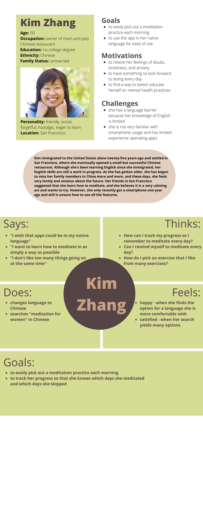
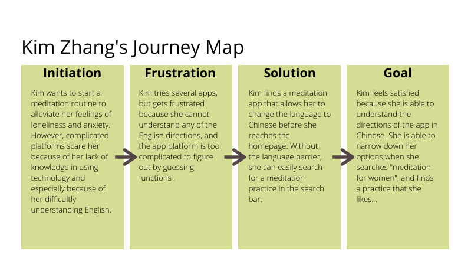
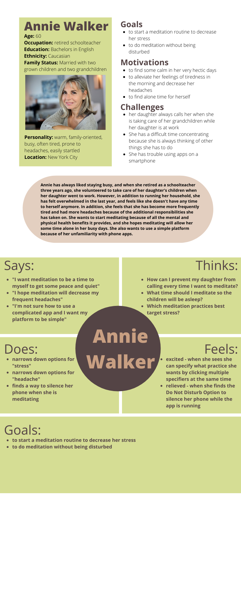
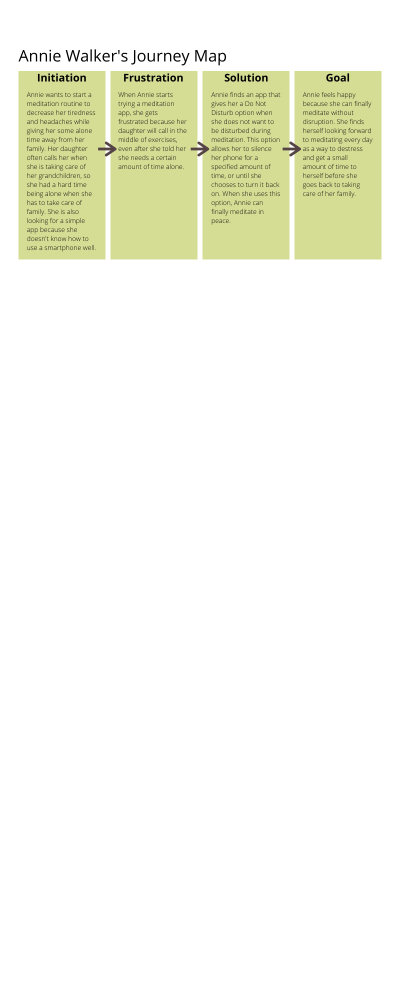
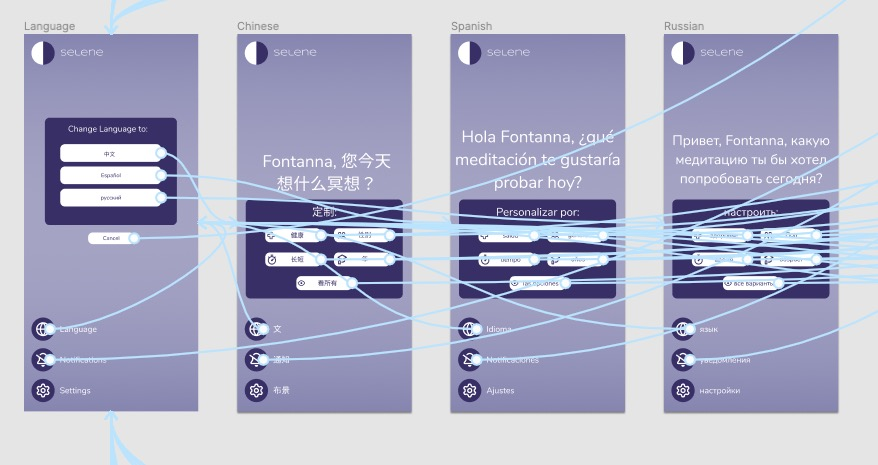
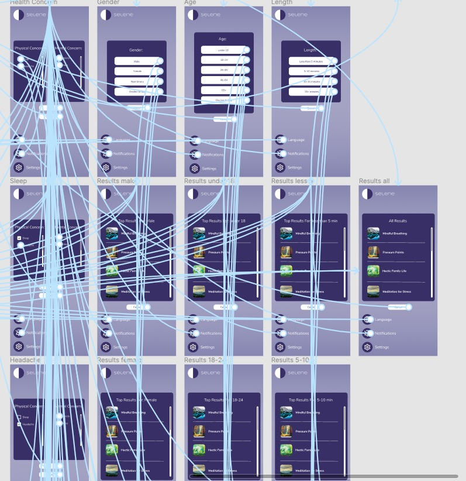

# Selene - Simple Meditation for Complex Lives
## Fontanna Yee - DH 150
### Introduction
My project is a meditation app called Selene, named after the moon goddess for a sense of calming, that incorporates a minimalist design for simplicity of use, especially for middle and older-aged users. 

### Clear design statement
My project hopes to assist primarily middle-aged women in finding a meditation practice that best addresses their physical and mental health concerns. In addition to daily life stressors such as working, running a household, and raising children, the current Covid-19 pandemic has created another external stressor that this target population has to face and overcome. With this in mind, and based on previous weeks of user research, I have identified three key features that minimize excess stress in a meditation routine. 

**Task 1: Changing the Language**

One of my personas is a middle-aged woman who doesn’t speak English as a native language, so I included a language button at the bottom left of each screen. When 
the user presses the button, three different language options appear. Once a language is selected, the user is redirected to the home screen. 

**Task 2: Turning off Notifications**

My second persona is a middle-aged woman who has a hectic family life and receives frequent calls from her daughter when she is taking care of her grandchildren. Because of this need, I included a notification feature at the bottom left of the screen as well. When the user presses the feature, they can choose to mute their notifications for a certain amount of time. Once a choice is selected, the user receives a confirmation. 

**Task 3: Customizing Meditation Options**

Both my personas are looking for simple designs with easy-to-recognize features, which is why I placed the customization panel on the home screen, which is easy to recognize and read. The customization panel is organized into different categories that have more specific options when the user clicks on it. 
hold, and raising children, the current Covid-19 pandemic has created another external stressor that this target population has to face and overcome. With this in mind, and based on previous weeks of user research, I have identified three key features that minimize excess stress in a meditation routine. 

### Competitor analysis

The first step of my project was to evaluate competitor sites to see what worked and what didn't. The two platforms I compared was a website called Mindful.org and a meditation app called Calm. 
[read more...](https://github.com/fyee1215/DH150-FontannaYee/blob/main/README.md)

<table>
  <tr>
    <td></td>
    <td></td>
  </tr>
</table>

### User research
After reviewing competitor apps, I conducted user research to gain a fresh perspective on what other users would like to see in a meditation app. 
[read more...](https://github.com/fyee1215/DH150-FontannaYee/tree/main/assignment04)

### UX storytelling [persona+scenario, assignment05]
After my contextual interview, I created user personas of the ideal users of my application to see if my application would best match their needs. 
[read more...](https://github.com/fyee1215/DH150-FontannaYee/tree/main/assignment05)

### Wireframe and graphic design element variation [assignment06 + part of 07]

### Low-fidelity prototype (wireflow, assignment06)
The purpose of this low-fidelity prototype is to test how to integrate these features into a functioning and intuitive layout and ensure that they can be used to achieve the goals intended. 
[read more...](https://github.com/fyee1215/DH150-FontannaYee/tree/main/assignment06)

### High-fidelity prototype (functional/interactive prototype, assignment08)
After many weeks of ideation, research, and usability testing, my high fidelity prototype solidifies many of the findings and adjustments I have made over the past few weeks into as close of a simulation of the real product as possible. By creating a high fidelity prototype, users can easily test the UX/UI functions of my meditation app and receive feedback for each action, and their testing will allow me to understand what processes are working well and what processes need additional adjustments. 

<iframe style="border: 1px solid rgba(0, 0, 0, 0.1);" width="800" height="450" src="https://www.figma.com/embed?embed_host=share&url=https%3A%2F%2Fwww.figma.com%2Fproto%2F7tdGK4IBQ5qoOybZ5Ay9Mz%2FDH150-HiFi-Prototype%3Fnode-id%3D1%253A2%26scaling%3Dmin-zoom" allowfullscreen></iframe>

### Optional evaluation and revision history 
Including cognitive walkthrough; impression test, accessibility audit, usability testing), per each summary and link to the notes (when you share the video or other detailed evidences, I will notify you when you can make the contents private as soon as your work is graded)

### Pitch video 

### Conclusion: what did you learn throughout the process?
