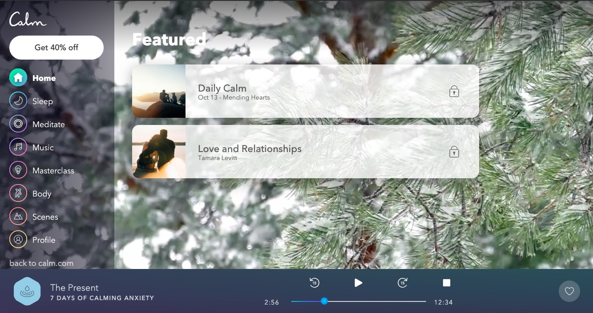
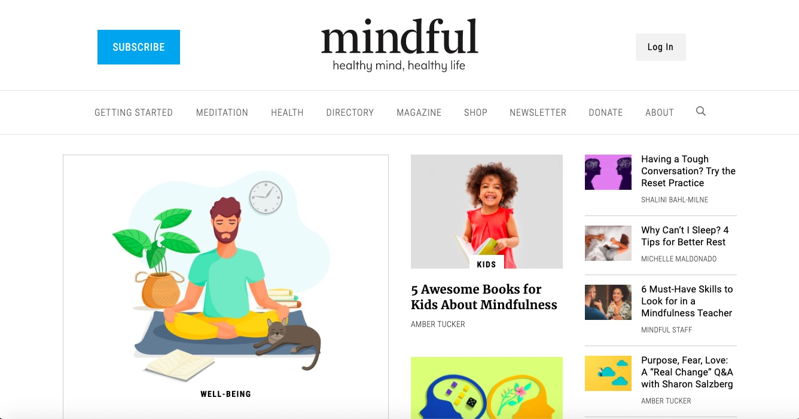
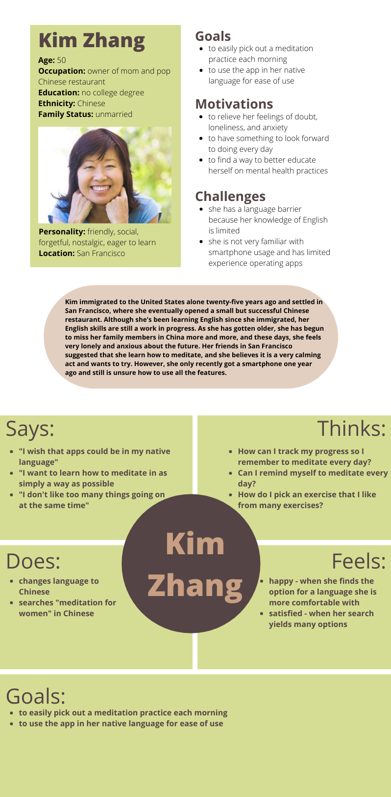
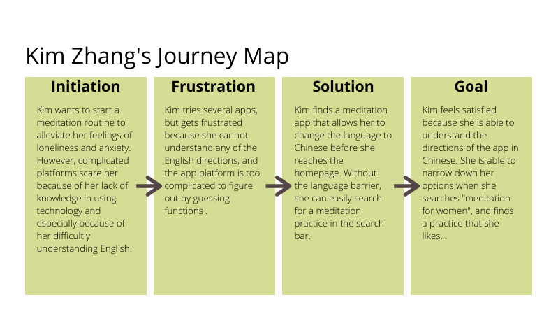
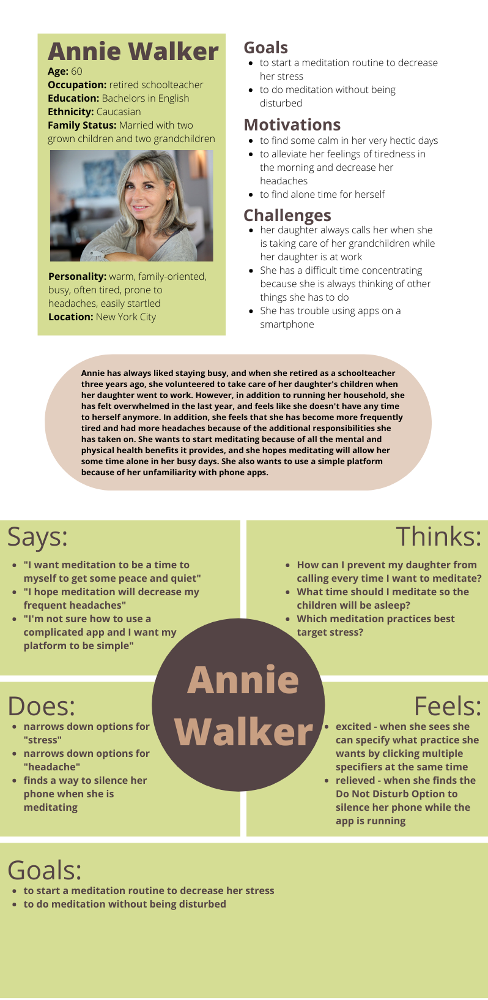
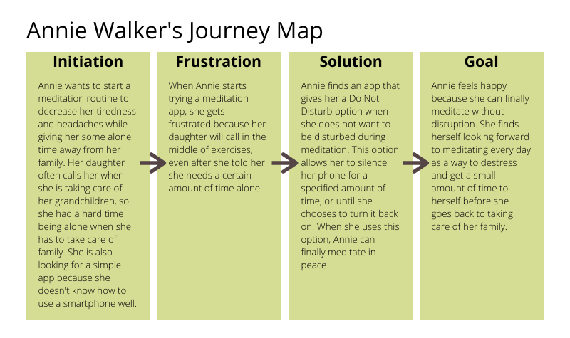
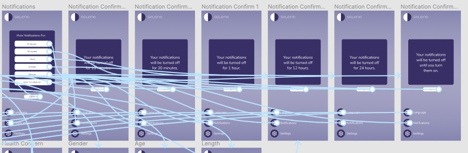

# Selene - Simple Meditation for Complex Lives
## Fontanna Yee - DH 150
### Introduction
When I was given the prompt to create a project that benefitted some aspect of life for middle-aged women, I decided to combine user experience with my interests in psychology and mental health to create a meditation application. Especially during the Covid-19 pandemic, mental health stressors have been at an all-time high, and I thought it was important to give older adults a platform to address mental health concerns. Many current meditation websites and apps are unnecessarily complicated and can be overwhelming for older adults to navigate and turn them away from the benefits of meditation, especially if they are unfamiliar with using technology. My goal in this project was to create a meditation app that replaced complicated interfaces and an overwhelming amount of choices with a simple, user-friendly design and clear options for customization. I hope that eliminating the stress of navigating complicated apps and websites would help older women, and adults in general, feel more comfortable creating a meditation routine that best addresses their daily life stressors, especially exacerbated by the pandemic. 

### Clear design statement
Based on weeks of research, usability testing, and contextual interviews, I prioritized simplicity and customization in my design. I primarily focused on assisting primarily middle-aged women in finding a meditation practice that best addresses their physical and mental health concerns. With this in mind, I identified three key features that minimized excess stress in a meditation routine, based on the two users personas that informed my design. 

**Task 1: Changing the Language**

One of my personas was a middle-aged woman who doesn’t speak English as a native language, so I included a language option that allows a user to change to a language that they are more comfortable using to interact with the app.This would make the app more appealing for users who were interested in meditation but intimidated by primarily English platforms. 

**Task 2: Turning off Notifications**

My second persona was a middle-aged woman who has a hectic family life and receives frequent calls from her daughter when she is taking care of her grandchildren. Because of this need, I included a notification option that allows users to mute external notifications for a specified amount of time. This feature would accommodate users who have constant disturbances on their phone that could interrupt the focus and concentration needed to meditate successfully. 

**Task 3: Customizing Meditation Options**

Both my personas were unfamiliar with using app interfaces and were looking for a simple, minimalistic platform to use that could accommodate for different needs. Because of this, I created a simple color-block design with easy-to-recognize features with large and clear labels, which would make navigating the app much easier and less stressful. I also placed the customization feature in the center of the home screen, which makes the customization options easy to identify. 

### Competitor analysis

The first step in user experience research was to examine competitor platforms that provided the same services that my application would be intended for, in this case, online meditation. I decided to evaluate both a web platform, Mindful.org, and a meditation app, Calm, to understand what features worked well and what features didn’t, and what were the most important features to include in a meditation application. 

**Heuristic Evaluation**

I first completed a heuristic evaluation of both platforms based on ten fundamental design principles that inform good design. For Mindful.org, my most important findings were that the platform needed to improve on the descriptions of topics so that users could find what they were looking for easier (Match between system and the real world), maintain consistency between the layouts of each page (Consistency and standards), and implement a much simpler and less cluttered design (Aesthetic and minimalist design). For Calm, my most important findings were that the design could have used more labels and text to identify the purpose of some icons (Recognition rather than recall), provide greater feedback during user error (Help users recognize, diagnose, and recover from errors), and place help features in more prominent places (Help and documentation). 

[Full Evaluation Here](https://github.com/fyee1215/DH150-FontannaYee/blob/main/README.md)

**Summary of Findings**

<table>
  <tr>
    <td></td>
    <td></td>
  </tr>
</table>

### User research
After reviewing competitor apps, I conducted user research to gain a fresh perspective on what other users would like to see in a meditation app. 
[read more...](https://github.com/fyee1215/DH150-FontannaYee/tree/main/assignment04)

### UX storytelling [persona+scenario, assignment05]
After my contextual interview, I created user personas of the ideal users of my application to see if my application would best match their needs. 
[read more...](https://github.com/fyee1215/DH150-FontannaYee/tree/main/assignment05)

### Wireframe and graphic design element variation [assignment06 + part of 07]

### Low-fidelity prototype (wireflow, assignment06)
The purpose of this low-fidelity prototype is to test how to integrate these features into a functioning and intuitive layout and ensure that they can be used to achieve the goals intended. 
[read more...](https://github.com/fyee1215/DH150-FontannaYee/tree/main/assignment06)

### High-fidelity prototype (functional/interactive prototype, assignment08)
After many weeks of ideation, research, and usability testing, my high fidelity prototype solidifies many of the findings and adjustments I have made over the past few weeks into as close of a simulation of the real product as possible. By creating a high fidelity prototype, users can easily test the UX/UI functions of my meditation app and receive feedback for each action, and their testing will allow me to understand what processes are working well and what processes need additional adjustments. 

<iframe style="border: 1px solid rgba(0, 0, 0, 0.1);" width="800" height="1000" src="https://www.figma.com/embed?embed_host=share&url=https%3A%2F%2Fwww.figma.com%2Fproto%2F7tdGK4IBQ5qoOybZ5Ay9Mz%2FDH150-HiFi-Prototype%3Fnode-id%3D1%253A2%26scaling%3Dmin-zoom" allowfullscreen></iframe>

Link to prototype [here](https://www.figma.com/proto/7tdGK4IBQ5qoOybZ5Ay9Mz/DH150-HiFi-Prototype?node-id=1%3A2&scaling=min-zoom)

### Optional evaluation and revision history 
The prototyping process was complex but ultimately extremely rewarding, as I learned a lot about the design and revision process, and how designing with the user in mind requires a lot of feedback from impression tests and cognitive walkthroughs. It surprised me how often features that intuitively made a lot of sense to me were confusing and ambiguous for the tester, but it was insightful in helping me adapt my design to best fit the user’s needs. It was also rewarding to learn how to use Figma in designing my prototype. I did not anticipate creating as many screens as I ended up creating, but I realized that some functions that I thought were simple, such as checkboxes, actually had dozens of combinations that I had to design individually. Throughout the whole process I was glad that I got the opportunity to learn design skills and gain feedback from users. 

Based on feedback from prototyping testing, I changed a few features, such as getting rid of the unnecessary and confusing menu bar, and adding in options for people who do not want to customize their meditation. As the designer, I didn’t realize that these features may or may not be necessary, and it was good to get feedback from users. I also changed some icons to be bigger and more visible. One suggestion that I believe requires further testing is whether the wording of the “cancel” button should be changed to “back,” as one user was confused, but the other testers understood the use of the button. Over time, with more users and more testing, I know that I will gain further insight into adjustments needed for my app prototype. 

[read more...](https://github.com/fyee1215/DH150-FontannaYee/tree/main/assignment07)

### Pitch video 

### Conclusion: what did you learn throughout the process?
